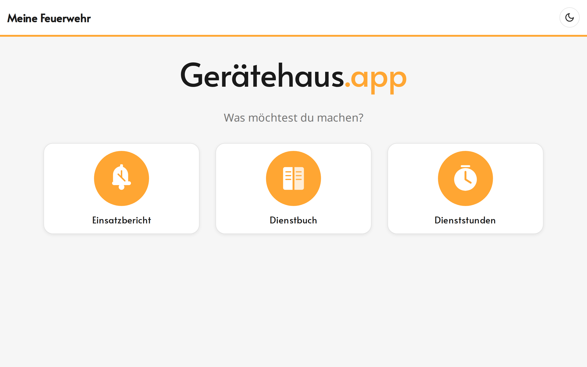
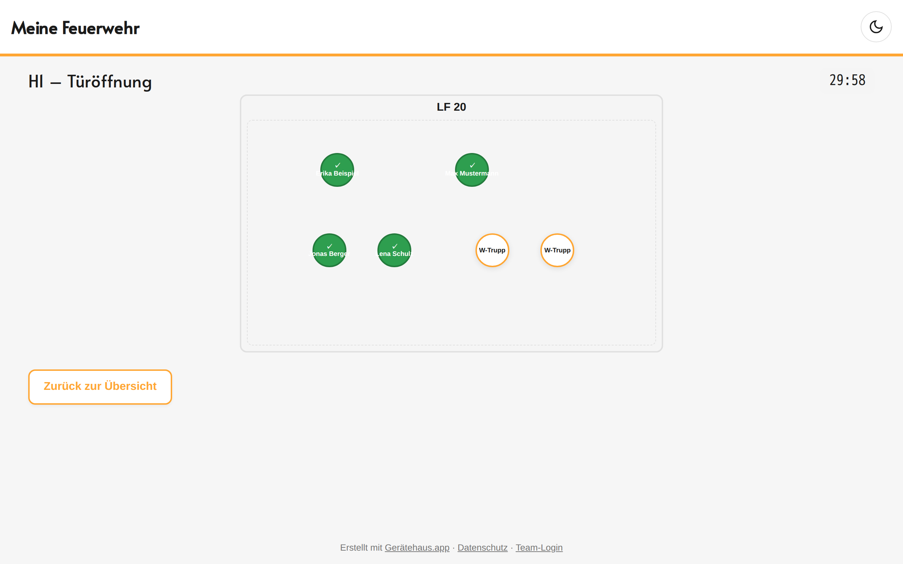
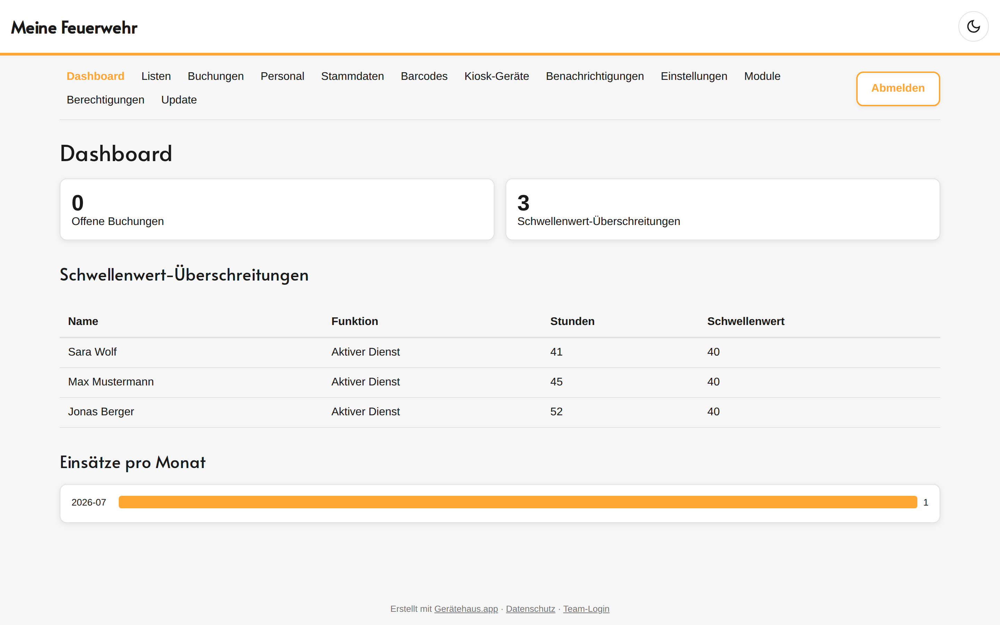
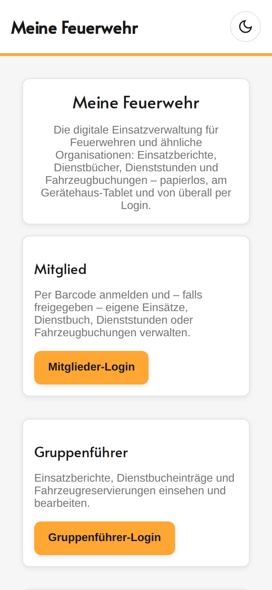

<div align="center">

# 🚒 Gerätehaus.app

**Die selbst hostbare, mobile-first PWA für Feuerwehren.**
Einsätze, Dienste, Dienststunden und Fahrzeugbuchungen – am Tablet im Gerätehaus per Namensauswahl + PIN oder optional per Barcode-Scan.

[](LICENSE)
[](#-tech-stack)
[](#-tech-stack)
[](#-schnellstart-docker)
[](#-design)
[](#-schnellstart-docker)

</div>

---

Gerätehaus.app läuft als **Kiosk** auf einem Tablet oder Bildschirm im Gerätehaus: Mitglieder
identifizieren sich – standardmäßig per **Namensauswahl + persönlichem PIN**, optional (Modul „Barcode")
per **Barcode-Scan** – und tragen sich für Einsätze, Dienste oder Dienststunden ein. Ein Moderator-Bereich
verwaltet alle Stammdaten, Personen und Einstellungen. Über den zusätzlichen **öffentlichen
Mitglieder-Login** lassen sich freigeschaltete Module auch von außerhalb – z. B. vom eigenen Smartphone –
nutzen.

> **Open-Source-Prinzip:** Kein einziger feuerwehr-spezifischer Wert steht hart im Code. Name, Logo,
> Farben, Module, Fahrzeuge, Sitzplätze, Funktionen und Zusatzfelder werden beim ersten Start über einen
> Einrichtungsassistenten festgelegt und sind danach jederzeit im Moderator-Bereich änderbar.

## 📑 Inhalt

- [Screenshots](#-screenshots)
- [Funktionen](#-funktionen)
- [Tech-Stack](#-tech-stack)
- [Schnellstart (Docker)](#-schnellstart-docker)
- [Konfiguration](#-konfiguration)
- [Lokale Entwicklung](#-lokale-entwicklung-ohne-docker)
- [Projektstruktur](#-projektstruktur)
- [Lizenz & Mitwirken](#-lizenz)

## 📸 Screenshots

<div align="center">

**Kiosk-Startseite** – große Modul-Kacheln am Gerätehaus-Tablet



</div>

<table>
<tr>
<td width="50%" valign="top">

**Einsatz-Garage**
Fahrzeuge mit Sitzplätzen, belegte Plätze in Grün, Countdown.



</td>
<td width="50%" valign="top">

**Moderator-Dashboard**
Schwellenwerte, offene Buchungen und Einsätze pro Monat auf einen Blick.



</td>
</tr>
</table>

<div align="center">

**Mitglieder-Login (mobil)** – Zugriff vom eigenen Smartphone



</div>

<sub>Screenshots einer Demo-Instanz mit Beispieldaten – keine echten Personendaten.</sub>

## ✨ Funktionen

### 🖥️ Kiosk & Mitglieder-Login

- **Kiosk-Startseite** – große, dynamisch skalierende Kacheln (nie Scrollen nötig), pro Modul einzeln
  ein- und ausblendbar; das Kiosk-Gerät wird per Geräte-Token autorisiert (kein Login nötig).
- **Identifikation per Namensauswahl + PIN** (Standard) – die Person sucht ihren Namen und bestätigt mit
  ihrem persönlichen PIN. Hat sie noch keinen PIN, fordert sie über einen Knopf einen **Self-Service-Link
  per E-Mail** an; ist keine E-Mail hinterlegt, geht stattdessen eine **Freigabe-Mail an die Moderatoren**
  (Ja/Nein), die dann E-Mail und optional den PIN setzen. Personen ohne PIN werden zusätzlich in einem
  einstellbaren Intervall automatisch per E-Mail erinnert (Modul Personal).
- **Modul „Barcode" (optional)** – ist es aktiv, identifizieren sich Mitglieder stattdessen per echtem
  **Code128-Strichcode** pro Person (konfigurierbare Gültigkeit); beim Scannen wird das Profilbild groß
  zur Bestätigung angezeigt, **Scan-Töne** geben sofortiges akustisches Feedback. Bestehende Instanzen
  behalten den Barcode-Login bei einem Update automatisch.
- **Öffentlicher Mitglieder-Login** – Identifikation am eigenen Smartphone per Namensauswahl + PIN bzw.
  Barcode; Zugriff auf alle für den Außenzugriff freigeschalteten Module, Abmelden jederzeit möglich.
- **„Barcode vergessen"** (bei aktivem Barcode-Modul) – erzeugt im Scan-Dialog einen QR-Code für genau
  diese Aktion; die Person scannt ihn mit dem eigenen Handy und trägt sich ohne Barcode ein (kurzlebiger,
  einmalig gültiger Token). Solche Eintragungen sind in Listen und PDF als „ohne Barcode" markiert.

### 🧩 Module

| Modul | Highlights |
|---|---|
| **Einsatztagebuch („Garage")** | Einsätze manuell oder per Divera-Import; Fahrzeuge als Kästen mit konfigurierbaren Sitzplätzen (Trupp/Staffel/Gruppe nach DIN 14502 oder frei), Eintragung per Barcode-Scan inkl. VAB & Atemschutzminuten, „Einsatzbereit im Feuerwehrhaus" und „Auf Anfahrt gewesen" als eigene Buchungsarten |
| **Einsatz-Zusatzfelder** | Frei konfigurierbare Text-, Mehrzeilen- oder Checkbox-Felder (z. B. Einsatzleiter, Lage, Tätigkeit) |
| **Einsatz-Countdown** | Timer in der Garage-Ansicht, springt bei jeder Eintragung zurück und schließt die Ansicht automatisch bei Ablauf |
| **Timeline** | Grafische Zeitleiste aller Ereignisse je Einsatz (Anlage, Eintragungen inkl. Fehlversuche, Detail-Änderungen mit Alt/Neu, Abschluss, E-Mail-Versand) |
| **Dienstbuch** | Schnelles Eintragen in zuletzt eröffnete Dienste |
| **Dienststunden** | Erfassung pro Person/Funktion, kumulierte Übersicht mit konfigurierbaren Schwellenwerten |
| **Fahrzeugbuchung** | Kalenderansicht mit Konflikterkennung und Moderator-Freigabe; Anfrage-Mails mit **Annehmen/Ablehnen-Buttons** ohne Login |
| **Barcode** | Optionale Identifikation per Code128-Strichcode statt Namensauswahl + PIN; eigene Modul-Unterseite zum Erzeugen/Erneuern und Versenden der Barcodes |

Jedes Modul ist einzeln **aktivierbar**, unabhängig davon auf der Kiosk-Startseite **ein-/ausblendbar**
und separat für den **Außenzugriff** (Mitglieder-Login) freischaltbar.

### 🛠️ Moderator-Bereich

- **Rollen & Berechtigungen** – Admin und Gruppenführer; Admins sehen alles, für die übrigen Moderatoren
  lässt sich der Zugriff **pro Modul granular freigeben** (Berechtigungs-Matrix).
- **Dashboard** mit konfigurierbaren Schwellenwert-Anzeigen für Dienststunden.
- **Gefilterte Listen** aller Einsätze, Dienstbücher, Dienststunden und Buchungen.
- **Stammdaten** – Fahrzeuge/Sitzplätze, Funktionen, Einsatz-Zusatzfelder, Personen (inkl. Barcodes),
  Kiosk-Geräte.
- **Module & Berechtigungen** – zentrale Modul-Übersicht und Rechte-Matrix pro Moderator.
- **Benachrichtigungen** – Telegram, E-Mail (SMTP, inkl. Testmail-Button) und Web-Push, vollständig im
  Moderator-Bereich konfigurierbar. Mails im **HTML-Design der Website**; die Einsatz-Benachrichtigung
  kann PDF-Bericht und Timeline enthalten. **Kanäle und Ereignisse sind pro Person einstellbar** –
  zugestellt wird nur an die freigegebenen Kanäle.
- **Divera 24/7** – Anbindung (Polling oder Webhook); importiert Alarme als Einsätze (inkl. **Adresse &
  Meldung**), gleicht das **Personal** ab (Vorschläge für neue Mitglieder) und kann Einsätze der letzten
  Tage nachholen. Änderungen wirken ohne Neustart.
- **Update** – zeigt verfügbare Versionen (Stable-/Beta-Kanal) und stößt Updates per Klick an.

### 🎨 Design

- **Dark Mode** automatisch anhand des Systemthemas
- **Fluide Typografie** – Schriftgröße passt sich der Bildschirmgröße an
- **PWA** – installierbar, Service Worker, Icon und Name aus der Konfiguration

### 🔒 Fehlerberichte & Monitoring

Optionale anonyme Fehlerberichte an den Entwickler über Sentry – in den Einstellungen aktivierbar,
standardmäßig aus. Es werden nur Stacktraces und technische Details gesendet, keine Personen- oder
Inhaltsdaten.

## 🧱 Tech-Stack

| Bereich | Technologie |
|---|---|
| **Backend** | Python 3.12 · FastAPI (async) · SQLAlchemy 2.0 · Alembic · PostgreSQL |
| **Frontend** | React 18 · TypeScript · Vite · React Router · `react-big-calendar` |
| **PDF-Export** | WeasyPrint (HTML/CSS-Templates) |
| **Barcodes** | `python-barcode` (Code128, serverseitig als PNG) |
| **Hintergrundjobs** | APScheduler (Divera-Polling & Personal-Abgleich, Einsatz-/Dienstbuch-Autoabschluss, Personen-Inaktivität, Barcode-Erneuerung, PIN-Erinnerung, Archivierung) |
| **Deployment** | Docker Compose (PostgreSQL + Backend + Nginx/Frontend) |

## 🚀 Schnellstart (Docker)

**Voraussetzungen:** [Docker](https://docs.docker.com/get-docker/) und
[Docker Compose](https://docs.docker.com/compose/install/).

```bash
# Repository klonen
git clone https://github.com/tobst96/geratehaus-app.git
cd geratehaus-app

# .env aus Vorlage erstellen
cp .env.example .env

# Secrets generieren und eintragen (macOS/Linux)
JWT_SECRET=$(openssl rand -hex 32)
COOKIE_SECRET=$(openssl rand -hex 32)
DB_PASSWORD=$(openssl rand -hex 32)
sed -i.bak "s/JWT_SECRET_KEY=.*/JWT_SECRET_KEY=$JWT_SECRET/" .env
sed -i.bak "s/COOKIE_SECRET_KEY=.*/COOKIE_SECRET_KEY=$COOKIE_SECRET/" .env
sed -i.bak "s/POSTGRES_PASSWORD=.*/POSTGRES_PASSWORD=$DB_PASSWORD/" .env

# Container starten
docker compose up -d
```

<details>
<summary><strong>Windows (PowerShell)</strong></summary>

```powershell
$env:JWT_SECRET = (openssl rand -hex 32)
$env:COOKIE_SECRET = (openssl rand -hex 32)
$env:DB_PASSWORD = (openssl rand -hex 32)

(Get-Content .env) -replace 'JWT_SECRET_KEY=.*', "JWT_SECRET_KEY=$env:JWT_SECRET" | Set-Content .env
(Get-Content .env) -replace 'COOKIE_SECRET_KEY=.*', "COOKIE_SECRET_KEY=$env:COOKIE_SECRET" | Set-Content .env
(Get-Content .env) -replace 'POSTGRES_PASSWORD=.*', "POSTGRES_PASSWORD=$env:DB_PASSWORD" | Set-Content .env
```

</details>

Die App ist danach unter **`http://localhost:9112`** erreichbar (Port über `HTTP_PORT` in `.env` änderbar).

| Aktion | Befehl |
|---|---|
| Status prüfen | `docker compose ps` |
| Logs ansehen | `docker compose logs -f` |
| App stoppen | `docker compose down` |

Beim allerersten Aufruf – solange die Datenbank leer ist und kein Moderator existiert – startet automatisch
der **Einrichtungsassistent**.

### Einrichtungsassistent

Der Wizard fragt in wenigen Schritten die Grunddaten ab:

1. **Name** der Organisation
2. **Logo** (optional, PNG oder SVG – PWA-Icons werden automatisch generiert)
3. **Primär- und Akzentfarbe**
4. **Admin-Passwort** für den Moderator-Login (mindestens 8 Zeichen)

Danach ist die App einsatzbereit. Der Wizard kann später über **Einstellungen → Setup-Wizard erneut
ausführen** wiederholt werden.

### Erste Schritte nach der Einrichtung

1. **Stammdaten → Fahrzeuge**: Fahrzeuge anlegen und Sitzplätze einrichten (Vorlage oder frei per
   Drag & Drop).
2. **Stammdaten → Personen**: Mitglieder anlegen, optional Profilbild hochladen.
3. **Barcodes**: Barcode pro Person erzeugen und ausdrucken.
4. **Einstellungen**: Module aktivieren/anzeigen, Divera und Benachrichtigungen konfigurieren.

## ⚙️ Konfiguration

Es gibt bewusst zwei getrennte Konfigurationswege:

| Wo | Was | Beispiel |
|---|---|---|
| `.env` | Rein technische/infrastrukturelle Werte, vor dem Start gesetzt | DB-Zugang, JWT-/Cookie-Secret, HTTP-Port |
| Moderator-Bereich (UI) | Fachliche/betriebliche Werte, jederzeit live änderbar | Organisationsname, Farben, Logo, Module, Personen, Fahrzeuge, Zusatzfelder, Benachrichtigungen, Divera, Zugänge |

Alle Variablen in `.env.example` sind kommentiert. Fachliche Werte gehören **nicht** in die `.env` – sie
werden ausschließlich über den Setup-Wizard bzw. den Moderator-Bereich gepflegt und landen in der
`app_config`-Tabelle.

### Benachrichtigungen aktivieren

Telegram, E-Mail (SMTP) und Web-Push lassen sich vollständig im Moderator-Bereich unter
**Benachrichtigungen** konfigurieren – Bot-Token, SMTP-Zugangsdaten und VAPID-Schlüssel werden in der
Datenbank gespeichert (keine `.env`-Bearbeitung nötig). Ein „Testmail senden"-Button prüft die
SMTP-Konfiguration direkt. Welche Ereignisse eine Person über welchen Kanal erhält, ist pro Person
einstellbar.

### Divera-24/7-Integration

Vollständig im Moderator-Bereich unter **Einstellungen → Divera 24/7** konfigurierbar: Anbindung
aktivieren, API-Key/Accesskey hinterlegen und Modus wählen (Polling alle 5 Minuten oder Webhook). Für
den Webhook-Modus die URL
`https://<deine-instanz>/api/v1/divera/webhook?accesskey=<dein-Accesskey>` bei Divera hinterlegen.
Änderungen wirken ohne Neustart.

### Backup

Internes Modul **Module → Backup**: erstellt vollständige, **verschlüsselte** Backups (gesamte
Datenbank + alle Dateien wie Logo/Bilder) als `.ghb`-Datei – geplant (Uhrzeit + Wochentage) oder per
Klick. Aufbewahrung als „max. Anzahl" (älteste wird gelöscht), Backup-Browser mit Download/Löschen,
und **Import** per Datei-Upload mit Auswahl, welche Bereiche (oder alles) ersetzt bzw. zusammengeführt
werden. Ziele: lokaler Ordner und WebDAV (Nextcloud/ownCloud). Für eine Sicherung **außerhalb des
Containers** den lokalen Zielordner als Host-Bind-Mount einhängen, z. B. in `docker-compose.yml`:
`- /pfad/auf/host/backups:/app/backups`. Passphrase im Modul hinterlegen – ohne sie ist kein Import
eines verschlüsselten Backups möglich.

Weitere Ziele: **S3-kompatibel** (AWS S3, MinIO, Backblaze B2 …), **SFTP/SSH** und **E-Mail-Versand**.
Optional lässt sich ein lokaler **MinIO** mitliefern: `docker compose --profile minio up -d` (Konsole
auf Port 9101, Bucket dort anlegen), im Modul als S3-Ziel `http://minio:9000` eintragen. **Hinweis:**
MinIO auf demselben Host ist kein Off-Site-Backup – zusätzlich ein externes Ziel wählen. Außerdem
können **alle erzeugten PDFs** (Einsatz-/Dienstbuch-Abschluss, Listen-Exporte) optional zusätzlich im
S3-Objektspeicher archiviert werden (PDF-Archiv).

**MinIO-Modul** (unter **Module**, an-/abschaltbar): bündelt die Objektspeicher-Verbindung (Endpoint,
Keys, Bucket-Namen) und legt bei aktivem Modul erzeugte Dokumente automatisch ab – **Einsätze** als
**Ordner je Einsatz** (`einsaetze/einsatz-<id>/` mit aktueller `einsatz.json` und `bericht.pdf`, Ordner
schon bei Anlage), **Dienstbücher** flach (`dienstbuecher/dienstbuch-<id>.pdf`). Das Backup-Modul kann
diese Verbindung über die Checkbox **„MinIO Backup"** mitnutzen.

## 💻 Lokale Entwicklung (ohne Docker)

**Voraussetzungen:** Python 3.12+, Node.js 18+ und npm, PostgreSQL 14+.

<details>
<summary><strong>Backend</strong></summary>

```bash
cd backend
python3.12 -m venv .venv
source .venv/bin/activate        # Windows: .venv\Scripts\activate
pip install -e ".[dev]"
cp ../.env.example ../.env
alembic upgrade head
uvicorn app.main:app --reload
```

Backend: `http://localhost:8000` · API-Docs: `http://localhost:8000/api/v1/docs`

</details>

<details>
<summary><strong>Frontend</strong></summary>

```bash
cd frontend
npm install
npm run dev
```

Frontend: `http://localhost:5173` (der Vite-Dev-Server proxyt `/api` und `/uploads` auf
`http://localhost:8000`).

</details>

## 📂 Projektstruktur

```
backend/    FastAPI-App, SQLAlchemy-Modelle, Alembic-Migrationen, Services
frontend/   React + Vite PWA
```

Der Aufbau innerhalb von `backend/app/` und `frontend/src/` orientiert sich an fachlichen Domänen
(Einsätze, Dienstbuch, Dienststunden, Buchungen, Personen, Moderator-Bereich) statt an technischen
Schichten.

## 📄 Lizenz

**MIT** – siehe [LICENSE](LICENSE). Du darfst Gerätehaus.app frei einsetzen, verändern und
weiterverbreiten, auch kommerziell. Wir freuen uns über einen Hinweis auf das Projekt, wenn du es
einsetzt oder weiterentwickelst.

## 🤝 Mitwirken

Issues und Pull Requests sind willkommen. Da Gerätehaus.app von beliebigen Organisationen selbst gehostet
wird, achte bei Beiträgen besonders darauf, **keine organisationsspezifischen Werte hart im Code zu
verankern** – alle fachlichen Konfigurationswerte gehören in die `app_config`-Tabelle, nicht in die
`.env`.

<div align="center">
<sub>Gebaut für die Feuerwehr. 🚒 Selbst gehostet, datensparsam, quelloffen.</sub>
</div>
